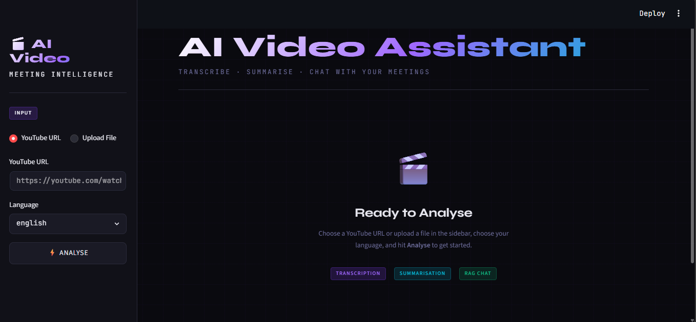
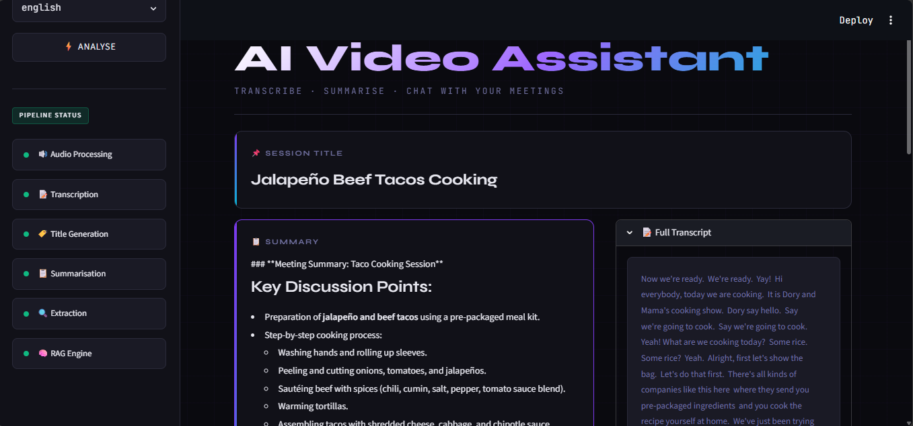
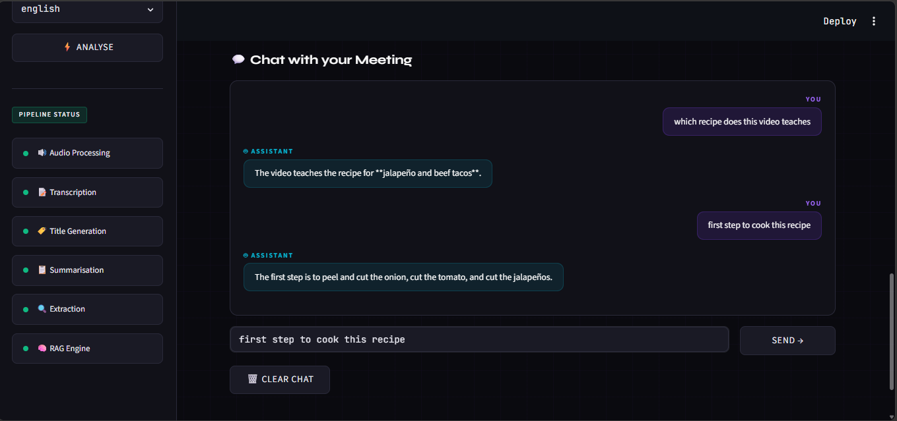
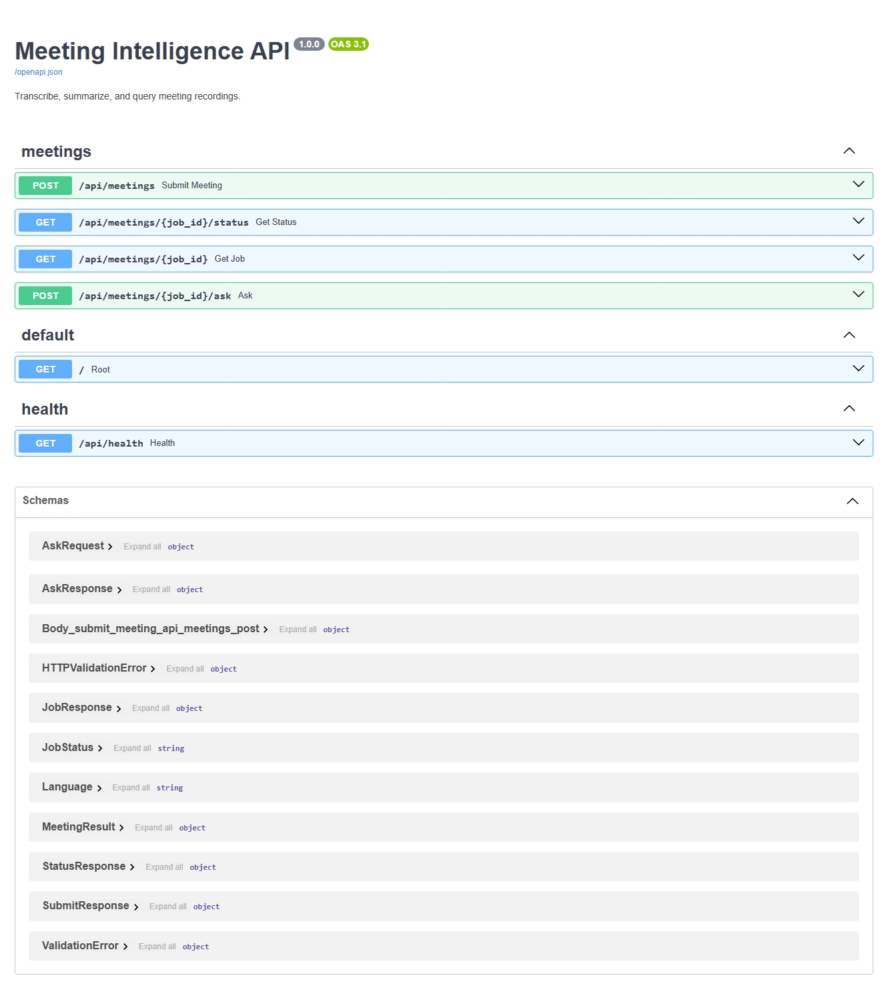

<p align="center">
  <h1 align="center">🎬 Meeting Intelligence</h1>
  <p align="center">
    Turn any meeting recording into a title, summary, action items, decisions, and a chatbot — via a FastAPI backend and a Streamlit frontend.
  </p>
</p>
<div align="center">


</div>

<br/>
<p align="center">
  
  
  
  
  
  
  
  
</p>

<p align="center">
  /<your-repo>?style=flat-square" alt="Last Commit">
  /<your-repo>?style=flat-square" alt="Issues">
  /<your-repo>?style=flat-square" alt="Stars">
</p>

---
## 📖 Overview

> Transform meeting recordings into structured knowledge with AI.

**Meeting Intelligence** is an end-to-end AI application that converts meeting recordings from **local files** or **YouTube videos** into searchable, actionable insights.

Instead of replaying long meetings or relying on incomplete notes, the application automatically **transcribes conversations**, **generates professional summaries**, **extracts action items and key decisions**, and creates a **Retrieval-Augmented Generation (RAG)** knowledge base for intelligent follow-up questions.

Built with a production-ready architecture, the project exposes all functionality through a documented **FastAPI REST API** and includes a modern **Streamlit** interface, making it easy to integrate into internal tools, workflows, or customer-facing applications.

---

## ✨ Key Features

| Category                            | Capability                                                                                           |
| :---------------------------------- | :--------------------------------------------------------------------------------------------------- |
| 🎥 **Flexible Input**               | Upload local audio/video files or analyze meetings directly from YouTube URLs                        |
| 🌍 **Multi-Language Transcription** | Faster-Whisper for English and Sarvam AI for Hinglish conversations                                  |
| 🧠 **AI-Powered Summarization**     | Generates concise executive summaries using a map-reduce pipeline with Mistral AI                    |
| 📋 **Meeting Intelligence**         | Automatically extracts titles, action items, key decisions, and open questions                       |
| 🔍 **RAG Chat Assistant**           | Ask natural-language questions and receive answers grounded only in the meeting transcript           |
| ⚡ **Asynchronous Processing**       | Long-running transcription jobs execute in the background while the API immediately returns a job ID |
| 🔒 **Meeting Isolation**            | Every meeting maintains its own vector database to ensure retrieval is scoped to that meeting only   |
| 🌐 **REST API**                     | Fully documented FastAPI endpoints with interactive Swagger/OpenAPI documentation                    |
| 🖥️ **Streamlit Frontend**          | Clean, responsive web interface for uploading recordings and interacting with the AI assistant       |
| 🐳 **Containerized Deployment**     | Separate Dockerfiles and Docker Compose configuration for frontend and backend                       |
| 🧪 **Testable Architecture**        | Offline unit tests with mocked AI services for reliable development and CI/CD                        |

---

## 🚀 What This Project Delivers

* 🎙️ Automatic meeting transcription
* 📝 Executive-quality summaries
* ✅ Action item extraction
* 📌 Key decision tracking
* ❓ Open question identification
* 💬 Context-aware RAG chatbot
* 🔎 Semantic search over meeting transcripts
* 🌐 Production-ready REST API
* 🐳 Docker-based deployment
* 📚 Interactive API documentation

---

## 🚀 Demo

| Service | Link |
| --- | --- |
| Frontend | `<your-streamlit-deployment-url>` |
| Backend API | `<your-api-deployment-url>` |
| API Docs (Swagger) | `<your-api-deployment-url>/docs` |

---

## 📸 Screenshots

<details>
<summary><b>🏠 Home — Upload & Analyze Documents</b></summary>
<br/>
<p align="center">
  
</p>

The landing page provides a clean interface for uploading PDF documents and interacting with the AI-powered RAG chatbot. Users can quickly process documents, explore extracted content, and begin asking natural language questions within seconds.

</details>

<details>
<summary><b>📄 Document Processing Results</b></summary>
<br/>
<p align="center">
  
</p>

Displays the extracted document content, processing status, and indexing results after ingestion. Users can verify successful document parsing before starting a conversation with the chatbot.

</details>

<details>
<summary><b>🤖 Intelligent RAG Chat Interface</b></summary>
<br/>
<p align="center">
  
</p>

Ask questions about your uploaded documents using natural language. The Retrieval-Augmented Generation (RAG) pipeline retrieves the most relevant document chunks and generates accurate, context-aware responses with source-backed information.

</details>

<details>
<summary><b>📚 Interactive API Documentation</b></summary>
<br/>
<p align="center">
  
</p>

Comprehensive FastAPI-powered API documentation for testing document upload, retrieval, and chat endpoints. Developers can explore request schemas, execute endpoints directly, and integrate the backend into external applications.

</details>


---


## 🏗 Architecture

```
┌─────────────────┐      HTTP (multipart / JSON)      ┌──────────────────────┐
│   Streamlit UI   │ ─────────────────────────────────▶ │     FastAPI Service   │
│     (app.py)     │ ◀───────────────────────────────── │        (api/)         │
└─────────────────┘        JSON (status / result)      └──────────┬────────────┘
                                                                    │
                                                       background thread pool
                                                                    │
                                                                    ▼
                                                        ┌────────────────────────┐
                                                        │      core pipeline      │
                                                        │  audio → transcript →   │
                                                        │  summary/extraction →   │
                                                        │  vector index → RAG     │
                                                        └────────────────────────┘
```

---

## 🛠 Tech Stack

| Category | Technologies |
| --- | --- |
| Backend | FastAPI, Uvicorn, Python 3.11 |
| Frontend | Streamlit |
| LLM Orchestration | LangChain, langchain-mistralai |
| AI / ML | Mistral AI (summarization, extraction, RAG), Faster-Whisper (English STT), Sarvam AI (Hinglish STT), Sentence-Transformers (`all-MiniLM-L6-v2`) |
| Vector Database | ChromaDB |
| Audio Processing | pydub, yt-dlp, ffmpeg |
| Networking | requests, tenacity (retries) |
| Testing | pytest |
| Deployment | Docker, Docker Compose |

---

## 📂 Project Structure

```
meeting-intelligence/
├── app/                      # Pipeline library (framework-agnostic)
|   ├── api/                       # FastAPI service
|   │   ├── main.py                  # App instance, CORS, error handlers
|   │   ├── routes.py                # /api/meetings endpoints
|   │   ├── job_store.py             # In-memory job queue + background execution
|   │   └── schemas.py               # Pydantic request/response models
|   |
|   ├── core/
|   │   ├── config.py               # Centralized settings, read once from env
|   │   ├── exceptions.py           # Typed exception hierarchy
|   │   ├── llm_factory.py          # Shared, cached Mistral client
|   │   ├── logging_config.py       # Central logging setup
|   │   ├── pipeline.py             # Orchestrates the full pipeline
|   │   └── prompts.py              # Centralises the prompts used
|   |
|   ├── services/
|   │   ├── audio_processor.py      # Download / convert / chunk audio
|   │   ├── extractor.py            # Action items / decisions / questions
|   │   ├── rag_engine.py           # Question-answering over a meeting
|   │   ├── summarizer.py           # Title + map-reduce summary
|   │   ├── transcriber.py          # Whisper (English) + Sarvam (Hinglish)
|   │   └── vector_store.py         # Per-meeting Chroma index
|   |
|   └── __init__.py
|
├── frontend/
|   └── streamlit_app.py             # Streamlit frontend (calls the API only)
|
├── tests/                           # Unit tests (mocked, no network/model calls)
│   ├── test_audio.py
│   ├── test_transcriber.py
│   ├── test_summary.py
│   └── test_rag.py
│
├── images/                    # README assets (screenshots, banner, diagrams)
├── main.py                    # CLI entry point (runs the pipeline directly)
|
├── .gitignore
├── requirements.txt
├── .env
├── .env.example
└── pytest.ini
```

---

## ⚙️ Installation

```bash
# 1. Clone the repository
git clone https://github.com/sharif-abusad/meeting-intelligence.git
cd meeting-intelligence

# 2. Create and activate a virtual environment
python -m venv .venv
source .venv/bin/activate        # Windows: .venv\Scripts\activate

# 3. Install dependencies
pip install -r requirements.txt

# 4. Configure environment variables
cp .env.example .env
# edit .env and set MISTRAL_API_KEY (and SARVAM_API_KEY if needed)
```

`ffmpeg` must also be installed and on your `PATH` (required for audio
conversion):

```bash
# macOS
brew install ffmpeg
# Ubuntu/Debian
sudo apt-get install ffmpeg
# Windows (via choco)
choco install ffmpeg
```

**Run the backend:**

```bash
uvicorn api.main:app --reload --port 8000
```

**Run the frontend** (in a second terminal):

```bash
streamlit run app.py
```

Open the URL Streamlit prints — typically `http://localhost:8501`.

---

## 📡 API Documentation

Interactive Swagger docs are auto-generated at `/docs` once the API is
running (e.g. `http://localhost:8000/docs`).

| Method | Endpoint | Description |
| --- | --- | --- |
| `GET` | `/api/health` | Health check |
| `POST` | `/api/meetings` | Submit a job (`youtube_url` **or** `file`, plus `language`, `chunk_minutes`, `build_index`). Returns `202` with a `job_id`. |
| `GET` | `/api/meetings/{job_id}/status` | Poll job status: `queued` / `processing` / `completed` / `failed` |
| `GET` | `/api/meetings/{job_id}` | Full result once completed: title, transcript, summary, action items, decisions, open questions |
| `POST` | `/api/meetings/{job_id}/ask` | Ask a follow-up question (`{"question": "..."}`), answered via RAG over the meeting transcript |

**Example Requests**

```bash
curl -X POST http://localhost:8000/api/meetings \
  -F "youtube_url=https://youtu.be/VIDEO_ID" \
  -F "language=english"
# → {"job_id": "a1b2c3d4e5f6", "status": "queued"}

curl http://localhost:8000/api/meetings/a1b2c3d4e5f6/status
curl http://localhost:8000/api/meetings/a1b2c3d4e5f6

curl -X POST http://localhost:8000/api/meetings/a1b2c3d4e5f6/ask \
  -H "Content-Type: application/json" \
  -d '{"question": "What did we decide about the launch date?"}'
```

---

## 🔄 Processing Pipeline

```
                 ┌──────────────┐
   Input ───────▶│ Audio Source │  (local file or YouTube URL)
                 └──────┬───────┘
                        ▼
                 ┌──────────────┐
                 │  Download /  │
                 │  Convert to  │
                 │  WAV, chunk  │
                 └──────┬───────┘
                        ▼
                 ┌──────────────┐
                 │ Transcription │ ── Whisper (English) / Sarvam (Hinglish)
                 └──────┬───────┘
                        │
          ┌─────────────┼─────────────────┐
          ▼             ▼                 ▼
   ┌─────────────┐┌─────────────┐┌────────────────┐
   │   Title +    ││  Action     ││  Vector Index   │
   │  Summary     ││  Items /    ││  (per-meeting   │
   │ (map-reduce) ││  Decisions /││   Chroma store) │
   │              ││  Questions  ││                 │
   └─────────────┘└─────────────┘└────────┬────────┘
                                            ▼
                                   ┌────────────────┐
                                   │   RAG Q&A on    │
                                   │  the transcript │
                                   └────────────────┘
```

---

## 🗺 Future Improvements

- [ ] Swap the in-memory job store for Celery/RQ + Redis for horizontal scaling
- [ ] WebSocket/SSE push instead of polling for job status
- [ ] Speaker diarization
- [ ] Multi-file / batch upload support
- [ ] User authentication (API keys or OAuth) in front of the FastAPI service
- [ ] CI/CD pipeline (lint, test, build, deploy on push)
- [ ] Structured evaluation suite (WER, summary quality, RAG relevance)
- [ ] Persistent job store with retry/resume on failure

---

## 🤝 Contributing

Contributions are welcome.

1. Fork the repository
2. Create a feature branch: `git checkout -b feature/your-feature`
3. Commit your changes: `git commit -m "Add your feature"`
4. Run the test suite: `pytest`
5. Push to your branch: `git push origin feature/your-feature`
6. Open a Pull Request describing the change and its motivation

Please keep pull requests focused and add/update tests for any behavioral
change.

---

## 📄 License

This project is licensed under the **MIT License** — see [LICENSE](LICENSE)
for details.

---

## 👤 Author


<div align="center">

**Sharif Abusad**

[](https://github.com/sharif-abusad)
[](https://linkedin.com/in/sharif-abusad)

*If you found this project useful, consider giving it a ⭐ on GitHub — it helps a lot!*

</div>

---

<p align="center">
Made with ❤️ using Python and Open Source Technologies
</p>